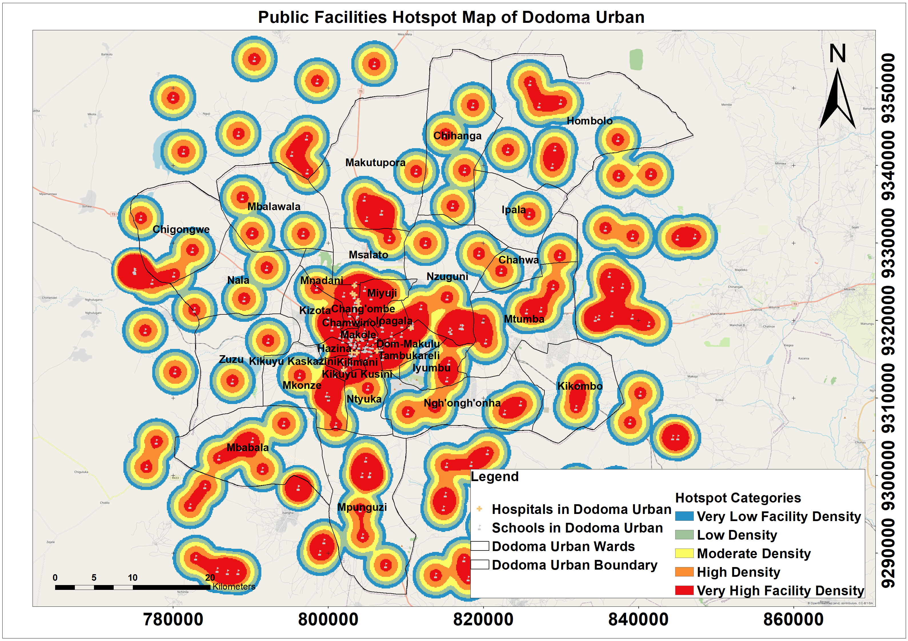

# 🌍 Geospatial Analysis Portfolio

### 📡 GIS & Remote Sensing Projects | Augustino Abraham

---

## 👨‍💻 About Me

I am a GIS & Remote Sensing Analyst specializing in **spatial analysis, predictive modeling, and environmental monitoring**.

I use tools like **QGIS, R, and remote sensing data** to solve real-world problems in infrastructure, urban planning, and environmental analysis.

---

# 🚀 Featured Projects

---

## 📡 1. TTCL Network Fault Prediction (Dodoma, Tanzania)

A GIS-based predictive model developed to identify **high-risk areas for fiber-optic network faults**, supporting proactive maintenance.

### 🔍 Key Highlights

* Integration of **environmental + spatial datasets**
* Predictive modeling using **GLM (Logistic Regression)**
* Excellent model performance (**AUC = 0.979**)
* GIS-based **Fault Risk Mapping**

### 🗺️ Preview

📂 Folder: `TTCL-Network-Fault-Prediction`

---

## 🔥 2. Burn Severity Analysis

A remote sensing project analyzing **fire-affected areas** using satellite imagery.

### 🔍 Key Highlights

* Raster classification techniques
* Burn severity mapping
* Environmental impact assessment

🗺️ Preview

📂 Folder: `Burn_Severity_Analysis`

---

## 🏙️ 3. Public Facilities Hotspot Analysis (Dodoma Urban)

A spatial analysis project identifying clusters of public facilities using **Kernel Density Estimation (KDE)**.

### 🔍 Key Highlights

* Spatial clustering using KDE
* Urban accessibility analysis
* Service distribution mapping

🗺️ Preview

📂 Folder: `Public_Facilities_Hotspot_Dodoma`

---

# 🛠️ Tools & Technologies

* QGIS
* R Studio (GLM, ROC, Statistical Analysis)
* ArcGIS
* Remote Sensing Data (SRTM, Satellite Imagery)

---

# 📊 What This Portfolio Demonstrates

* Spatial data analysis and visualization
* Predictive modeling in GIS
* Remote sensing applications
* Decision-support system development

---

# 🌐 Connect With Me

* LinkedIn: *(Add your link here)*
* GitHub: https://github.com/Augustino-Abraham

---

# 💡 Portfolio Purpose

This portfolio showcases my ability to:

* Analyze spatial and environmental data
* Build GIS-based predictive models
* Develop practical solutions for real-world problems
* Communicate insights through maps and visualizations

---
